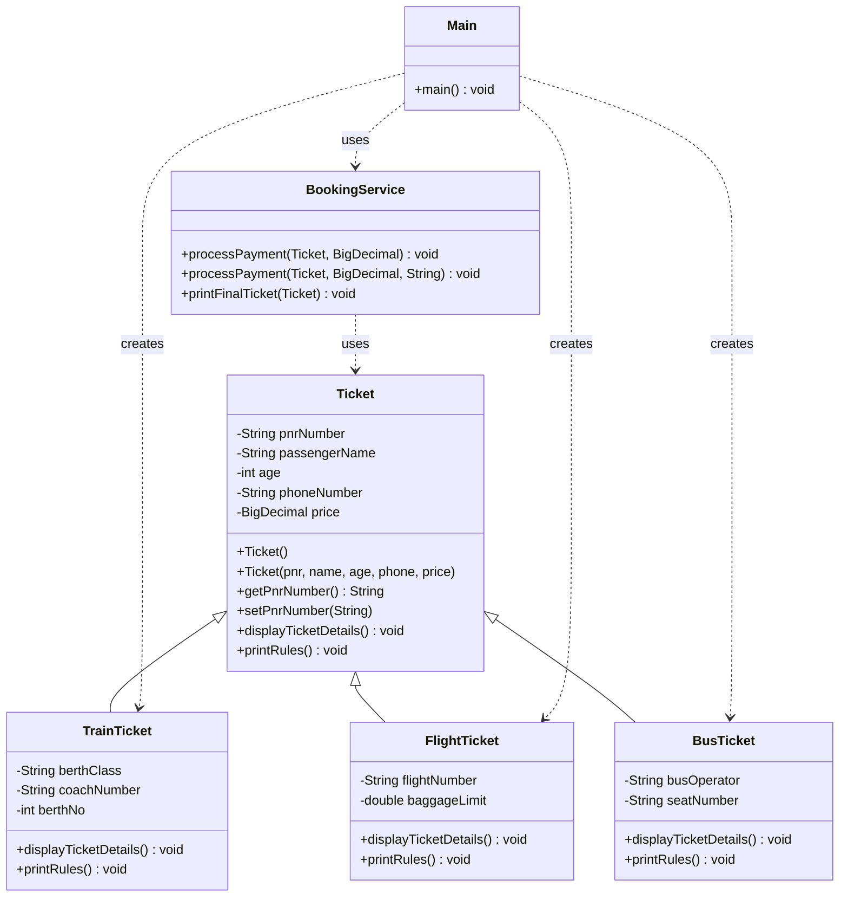

# 🎫 Ticket Booking System — Java OOP Design

A backend-style **Ticket Booking System** built to demonstrate core Object-Oriented
Design principles in Java. One unified `Ticket` model branches into three real-world
ticket types — **Train**, **Flight**, and **Bus** — all handled through a single,
polymorphic `BookingService`.

---

## 📐 Architecture


<svg viewBox="0 0 1160 760" xmlns="http://www.w3.org/2000/svg" font-family="Segoe UI, Helvetica, Arial, sans-serif">
  <defs>
    <marker id="arrow" markerWidth="10" markerHeight="10" refX="9" refY="3" orient="auto" markerUnits="strokeWidth">
      <path d="M0,0 L0,6 L9,3 z" fill="#4b5563"/>
    </marker>
    <marker id="hollowArrow" markerWidth="14" markerHeight="14" refX="12" refY="6" orient="auto" markerUnits="userSpaceOnUse">
      <path d="M1,1 L12,6 L1,11 z" fill="white" stroke="#4b5563" stroke-width="1"/>
    </marker>
  </defs>

  <rect x="0" y="0" width="1160" height="760" fill="#0f172a"/>

  <!-- Ticket parent class -->
  <g>
    <rect x="440" y="20" width="280" height="150" rx="8" fill="#1e293b" stroke="#64748b" stroke-width="1.5"/>
    <rect x="440" y="20" width="280" height="30" rx="8" fill="#334155"/>
    <text x="580" y="40" text-anchor="middle" fill="#f8fafc" font-size="15" font-weight="600">Ticket</text>
    <line x1="440" y1="50" x2="720" y2="50" stroke="#64748b"/>
    <text x="450" y="68" fill="#cbd5e1" font-size="11">- pnrNumber, passengerName</text>
    <text x="450" y="84" fill="#cbd5e1" font-size="11">- age, phoneNumber</text>
    <text x="450" y="100" fill="#cbd5e1" font-size="11">- price : BigDecimal</text>
    <line x1="440" y1="110" x2="720" y2="110" stroke="#64748b"/>
    <text x="450" y="128" fill="#93c5fd" font-size="11">+ displayTicketDetails()</text>
    <text x="450" y="144" fill="#93c5fd" font-size="11">+ printRules()</text>
    <text x="450" y="160" fill="#93c5fd" font-size="11">+ getters / setters</text>
  </g>

  <!-- Train -->
  <g>
    <rect x="60" y="260" width="270" height="140" rx="8" fill="#1e293b" stroke="#64748b" stroke-width="1.5"/>
    <rect x="60" y="260" width="270" height="28" rx="8" fill="#334155"/>
    <text x="195" y="279" text-anchor="middle" fill="#f8fafc" font-size="14" font-weight="600">TrainTicket</text>
    <line x1="60" y1="288" x2="330" y2="288" stroke="#64748b"/>
    <text x="70" y="305" fill="#cbd5e1" font-size="11">- berthClass, coachNumber</text>
    <text x="70" y="321" fill="#cbd5e1" font-size="11">- berthNo</text>
    <line x1="60" y1="330" x2="330" y2="330" stroke="#64748b"/>
    <text x="70" y="347" fill="#93c5fd" font-size="11">+ displayTicketDetails()</text>
    <text x="70" y="363" fill="#93c5fd" font-size="11">+ printRules()</text>
    <text x="70" y="380" fill="#64748b" font-size="10" font-style="italic">@Override</text>
  </g>

  <!-- Flight -->
  <g>
    <rect x="445" y="260" width="270" height="140" rx="8" fill="#1e293b" stroke="#64748b" stroke-width="1.5"/>
    <rect x="445" y="260" width="270" height="28" rx="8" fill="#334155"/>
    <text x="580" y="279" text-anchor="middle" fill="#f8fafc" font-size="14" font-weight="600">FlightTicket</text>
    <line x1="445" y1="288" x2="715" y2="288" stroke="#64748b"/>
    <text x="455" y="305" fill="#cbd5e1" font-size="11">- flightNumber</text>
    <text x="455" y="321" fill="#cbd5e1" font-size="11">- baggageLimit : double</text>
    <line x1="445" y1="330" x2="715" y2="330" stroke="#64748b"/>
    <text x="455" y="347" fill="#93c5fd" font-size="11">+ displayTicketDetails()</text>
    <text x="455" y="363" fill="#93c5fd" font-size="11">+ printRules()</text>
    <text x="455" y="380" fill="#64748b" font-size="10" font-style="italic">@Override</text>
  </g>

  <!-- Bus -->
  <g>
    <rect x="830" y="260" width="270" height="140" rx="8" fill="#1e293b" stroke="#64748b" stroke-width="1.5"/>
    <rect x="830" y="260" width="270" height="28" rx="8" fill="#334155"/>
    <text x="965" y="279" text-anchor="middle" fill="#f8fafc" font-size="14" font-weight="600">BusTicket</text>
    <line x1="830" y1="288" x2="1100" y2="288" stroke="#64748b"/>
    <text x="840" y="305" fill="#cbd5e1" font-size="11">- busOperator</text>
    <text x="840" y="321" fill="#cbd5e1" font-size="11">- seatNumber</text>
    <line x1="830" y1="330" x2="1100" y2="330" stroke="#64748b"/>
    <text x="840" y="347" fill="#93c5fd" font-size="11">+ displayTicketDetails()</text>
    <text x="840" y="363" fill="#93c5fd" font-size="11">+ printRules()</text>
    <text x="840" y="380" fill="#64748b" font-size="10" font-style="italic">@Override</text>
  </g>

  <!-- Inheritance arrows (hollow triangle, pointing up to Ticket) -->
  <line x1="195" y1="260" x2="560" y2="172" stroke="#4b5563" stroke-width="1.5" marker-end="url(#hollowArrow)"/>
  <line x1="580" y1="260" x2="580" y2="172" stroke="#4b5563" stroke-width="1.5" marker-end="url(#hollowArrow)"/>
  <line x1="965" y1="260" x2="600" y2="172" stroke="#4b5563" stroke-width="1.5" marker-end="url(#hollowArrow)"/>

  <!-- BookingService -->
  <g>
    <rect x="380" y="470" width="400" height="120" rx="8" fill="#1e293b" stroke="#f59e0b" stroke-width="1.5"/>
    <rect x="380" y="470" width="400" height="28" rx="8" fill="#78350f"/>
    <text x="580" y="489" text-anchor="middle" fill="#fde68a" font-size="14" font-weight="600">BookingService</text>
    <line x1="380" y1="498" x2="780" y2="498" stroke="#78350f"/>
    <text x="390" y="516" fill="#93c5fd" font-size="11">+ processPayment(Ticket, BigDecimal)</text>
    <text x="390" y="532" fill="#93c5fd" font-size="11">+ processPayment(Ticket, BigDecimal, upiId)  ← overload</text>
    <text x="390" y="548" fill="#93c5fd" font-size="11">+ printFinalTicket(Ticket ticket)  ← polymorphic call</text>
  </g>

  <!-- dashed "uses" arrow from BookingService up to Ticket -->
  <line x1="580" y1="470" x2="580" y2="200" stroke="#f59e0b" stroke-width="1.5" stroke-dasharray="5,4" marker-end="url(#arrow)"/>
  <text x="595" y="330" fill="#f59e0b" font-size="11" font-style="italic">uses (Ticket ref.)</text>

  <!-- Main -->
  <g>
    <rect x="480" y="650" width="200" height="70" rx="8" fill="#1e293b" stroke="#64748b" stroke-width="1.5"/>
    <rect x="480" y="650" width="200" height="26" rx="8" fill="#334155"/>
    <text x="580" y="668" text-anchor="middle" fill="#f8fafc" font-size="14" font-weight="600">Main</text>
    <text x="500" y="700" fill="#93c5fd" font-size="11">+ main()</text>
  </g>

  <line x1="580" y1="650" x2="580" y2="590" stroke="#4b5563" stroke-width="1.5" stroke-dasharray="5,4" marker-end="url(#arrow)"/>
  <text x="595" y="622" fill="#94a3b8" font-size="11" font-style="italic">creates &amp; uses</text>

  <!-- Legend -->
  <g font-size="11" fill="#94a3b8">
    <line x1="60" y1="740" x2="90" y2="740" stroke="#4b5563" stroke-width="1.5" marker-end="url(#hollowArrow)"/>
    <text x="98" y="744">inheritance (extends)</text>
    <line x1="280" y1="740" x2="310" y2="740" stroke="#4b5563" stroke-width="1.5" stroke-dasharray="5,4" marker-end="url(#arrow)"/>
    <text x="318" y="744">dependency (uses / creates)</text>
  </g>
</svg>

> GitHub renders this diagram automatically — no image files needed.

---

## 🧠 OOP Concepts Used

| Concept | Where it's used | Why |
|---|---|---|
| **Encapsulation** | All `Ticket` fields are `private`, exposed via getters/setters | Protects internal state, allows validation |
| **Java Bean pattern** | No-arg constructor + all-args constructor + getters/setters | Framework-friendly (Spring, Jackson, Hibernate) |
| **Inheritance** | `TrainTicket`, `FlightTicket`, `BusTicket` extend `Ticket` | Reuse common fields (pnr, name, age, phone, price) |
| **`super`** | Used in child constructors and inside overridden methods | Initializes parent fields, reuses parent logic |
| **Method Overriding** | `displayTicketDetails()` and `printRules()` in each child | Each ticket type prints its own specific details/rules |
| **Method Overloading** | `processPayment(...)` — 2-arg and 3-arg versions | Supports both normal and UPI payments |
| **Runtime Polymorphism** | `BookingService.printFinalTicket(Ticket ticket)` | One method works correctly for train, flight, or bus tickets |

---

## 📂 Project Structure

```
ticket-booking-system/
├── Ticket.java            # Parent class — common fields + Java Bean setup
├── TrainTicket.java        # Extends Ticket — berth/coach specific
├── FlightTicket.java       # Extends Ticket — flight/baggage specific
├── BusTicket.java          # Extends Ticket — operator/seat specific
├── BookingService.java     # Business logic — payments + polymorphic printing
├── Main.java               # Entry point — creates objects, runs the flow
└── README.md
```

---

## ▶️ How It Works

1. `Main` creates a `TrainTicket`, `FlightTicket`, and `BusTicket` using their all-args
   constructors (each internally calls `super(...)` to fill the common `Ticket` fields).
2. `BookingService.processPayment(...)` is called — Java picks the correct overload
   based on whether a UPI ID is passed.
3. `BookingService.printFinalTicket(Ticket ticket)` is called for each object. Even
   though the method only knows about the parent type `Ticket`, Java resolves
   `displayTicketDetails()` and `printRules()` to each object's **actual** subclass
   at runtime — that's polymorphism doing the work.

### Sample Output

```
====== TICKET CONFIRMATION ======
-----------------------------------
PNR Number : PNR101
Passenger  : Balu (Age: 27)
Contact    : 9876543210
Price      : ₹1200.00
Berth Class: 3AC
Coach/Berth: B2 - 72
Train Rules: Carry original Govt ID. No loud music after 10 PM.
=================================
```

---

## 🛠️ Tech Used

- **Java** — core language, no external frameworks
- **BigDecimal** — for accurate money handling instead of `double`
- **Mermaid** — for the architecture diagram (renders natively on GitHub)

---

## 📌 Notes

- This is a **design/learning project** focused on demonstrating clean OOP structure —
  not a production booking system (no real payment gateway or database yet).
- Natural next steps: add an `interface PaymentProcessor`, a `List<Ticket>` booking
  history in `BookingService`, and persist tickets to a database.